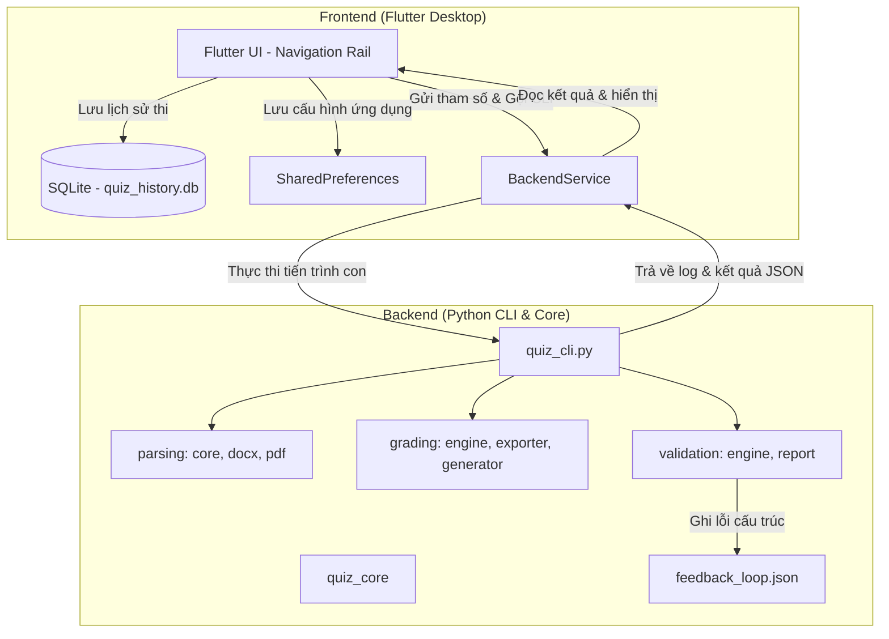

# Tổng quan Hệ thống Quiz Processor

Hệ thống **Quiz Processor** là một giải pháp lai (hybrid) kết hợp giữa sức mạnh xử lý tài liệu của **Python** (Backend) và trải nghiệm giao diện người dùng mượt mà của **Flutter Desktop** (Frontend). Hệ thống hỗ trợ xử lý đề thi trắc nghiệm từ định dạng PDF/DOCX, số hóa đề thành định dạng số (JSON/DOCX), tổ chức phòng thi trực tuyến tương tác, tự động chấm điểm bài làm và phân tích kết quả học tập chi tiết.

---

## 1. Kiến trúc Tổng quan (System Architecture)

Hệ thống được thiết kế theo mô hình **Client-Server cục bộ (Local Hybrid Architecture)**, trong đó ứng dụng Flutter đóng vai trò làm giao diện điều khiển (Client) và giao tiếp với nhân xử lý Python (Backend) thông qua cơ chế thực thi tiến trình con CLI (Command-Line Interface).



### Cách thức Giao tiếp (IPC Mechanism)
* **Khởi tạo**: Lớp [BackendService](file:///d:/My_projects/Random_Essential/Quiz_Processor/quiz_flutter_ui/lib/services/backend_service.dart) trong Flutter sử dụng `Process.start` để chạy lệnh:
  * Trong môi trường dev: `python quiz_cli.py --action <action> [params...]`
  * Trong môi trường production (đóng gói): `quiz_cli.exe --action <action> [params...]`
* **Truyền dữ liệu**: Các tham số đầu vào được truyền dưới dạng cờ lệnh CLI (ví dụ: `--input`, `--output`, `--answer-file`).
* **Nhận phản hồi**: Python gửi thông tin phản hồi ngược về Flutter qua Standard Output (`stdout`) dưới dạng các dòng JSON riêng biệt:
  * Log trạng thái tiến trình: `{"type": "log", "message": "..."}`
  * Kết quả trả về cuối cùng: `{"type": "result", "status": "success/error", ...}`
  Flutter lắng nghe luồng dữ liệu này bằng `LineSplitter` để giải mã JSON theo thời gian thực và cập nhật UI.

---

## 2. Cấu trúc Thư mục Dự án (Directory Structure)

Thư mục làm việc của hệ thống có bố cục rõ ràng, phân tách giữa logic backend và giao diện frontend:

```text
Quiz_Processor/
│
├── quiz_core/                      # Nhân xử lý logic Python (Backend Core)
│   ├── parsing/                    # Module phân tích đề thi
│   │   ├── core.py                 # Hàm phân tích câu hỏi & đáp án cốt lõi
│   │   ├── pdf_parser.py           # Trích xuất văn bản từ PDF qua PyMuPDF
│   │   ├── docx_parser.py          # Đọc/ghi tài liệu Microsoft Word
│   │   ├── patterns.py             # Tập hợp các Regex nhận diện câu hỏi/đáp án
│   │   └── utils.py                # Tiện ích chuẩn hóa chuỗi và xử lý nhiễu
│   │
│   ├── grading/                    # Module chấm bài & sinh đề
│   │   ├── engine.py               # Logic đối chiếu bài làm và đáp án
│   │   ├── matching.py             # Thuật toán ghép cặp câu hỏi (Text/Number/Index)
│   │   ├── exporter.py             # Xuất file báo cáo câu lỗi (DOCX) & đề thi (JSON)
│   │   └── generator.py            # Tạo đề ngẫu nhiên hoặc theo khoảng câu
│   │
│   ├── validation/                 # Module kiểm định chất lượng số hóa
│   │   ├── engine.py               # Kiểm định cấu trúc, double-check & feedback loop
│   │   └── report.py               # Xuất tài liệu báo cáo kiểm định chất lượng
│   │
│   ├── models.py                   # Định nghĩa các Data Class dùng chung
│   └── __init__.py                 # Export API của core
│
├── quiz_flutter_ui/                # Giao diện người dùng Desktop (Flutter Frontend)
│   ├── lib/
│   │   ├── main.dart               # Điểm khởi chạy ứng dụng & Window Manager
│   │   ├── screens/                # Giao diện các chức năng ứng dụng
│   │   │   ├── digitize_screen.dart   # Màn hình Số hóa & Kiểm định đề PDF
│   │   │   ├── exam_list_screen.dart  # Màn hình phòng thi trực tuyến & tab phụ
│   │   │   ├── quiz_taking_screen.dart# Màn hình làm bài tương tác trực tiếp
│   │   │   ├── quiz_result_screen.dart# Màn hình hiển thị kết quả & đối chiếu bài làm
│   │   │   ├── generate_screen.dart   # Màn hình thiết lập & sinh đề thi trắc nghiệm
│   │   │   ├── analytics_screen.dart  # Màn hình phân tích đồ thị học tập
│   │   │   └── settings_screen.dart   # Màn hình cấu hình hệ thống & phím tắt
│   │   │
│   │   ├── services/               # Lớp dịch vụ quản lý dữ liệu/logic
│   │   │   ├── backend_service.dart   # Quản lý tiến trình CLI Python
│   │   │   ├── database_service.dart  # Kết nối cơ sở dữ liệu lịch sử (SQLite)
│   │   │   ├── settings_service.dart  # Quản lý cấu hình lưu trữ SharedPreferences
│   │   │   ├── backup_service.dart    # Sao lưu / Khôi phục toàn bộ Workspace (Zip)
│   │   │   └── update_service.dart    # Kiểm tra cập nhật ứng dụng tự động qua GitHub
│   │   │
│   │   └── widgets/                # Các widget tái sử dụng (LogConsole, PathSelector)
│   │
│   └── pubspec.yaml                # Khai báo thư viện phụ thuộc của Flutter
│
├── docs/                           # Tài liệu kỹ thuật chi tiết của hệ thống
├── scratch/                        # Script kiểm tra / vá lỗi file nguồn (dev-only)
│   ├── fix_docx.py                 # Vá lỗi cấu trúc DOCX theo feedback_loop.json
│   ├── inspect_docx.py             # Kiểm tra paragraph layout của tệp DOCX
│   └── dump_pages.py               # Dump nội dung trang từ PDF gốc để đối chiếu
├── test_workspace/                 # Workspace thử nghiệm
│   └── feedback_loop.json          # Registry ghi nhận lỗi cấu trúc câu hỏi
├── quiz_cli.py                     # Cổng kết nối CLI điều hướng API backend
├── quiz_pdf_processor.py           # Facade CLI tương thích ngược với API cũ
├── config.py                       # Quản lý cấu hình Python (legacy)
├── requirements.txt                # Danh sách thư viện Python phụ thuộc
└── QuizCLI.spec                    # File cấu hình đóng gói PyInstaller
```

---

## 3. Quản lý Không gian làm việc (Workspace Management)

Hệ thống quản lý tài liệu trong một thư mục gọi là **Workspace**.
* **Đường dẫn mặc định**: `C:\Users\<Tên_User>\Documents\QuizProcessor` hoặc thư mục `quiz_workspace` tại vị trí chạy app.
* **Cơ cấu thư mục con bên trong Workspace**:
  * `/exams`: Lưu trữ các tệp đề thi ở dạng số hóa tương tác JSON. Có thể tạo các thư mục con tùy chỉnh theo môn học tại đây để phân loại (ví dụ: `/exams/Toan_Cao_Cap`).
  * `/digits`: Nơi lưu trữ tạm thời trong quá trình xử lý đề.
  * `/exports`: Thư mục mặc định xuất các tệp báo cáo hoặc đề trắc nghiệm mới sinh ra.
  * `quiz_history.db`: Cơ sở dữ liệu SQLite lưu trữ lịch sử tất cả các lần tham gia thi của người dùng.
  * `current_session.json`: Tệp lưu trạng thái làm bài dở dang để hỗ trợ tính năng **Auto-Save & Tự động phục hồi trạng thái thi**.
  * `feedback_loop.json`: Registry JSON tích lũy các lỗi cấu trúc câu hỏi được phát hiện tự động hoặc báo cáo thủ công, dùng làm dữ liệu đầu vào để sửa đổi tệp nguồn.

---

## 4. Lịch sử Nâng cấp Hệ thống

1. **Khởi tạo và scaffold ban đầu** (`1bb2e5a` - `6591fbd`): Xây dựng bộ khung xử lý tài liệu cơ bản, viết app Tkinter cũ (`quiz_app.py`), thiết lập cơ chế xuất các file DOCX phục vụ in đề và đáp án.
2. **Nâng cấp công cụ grading và validation** (`f487bc0` - `2bdc708`): Cải tiến phát hiện đáp án trong các file PDF xuất từ LMS (như Moodle/Studocu). Tối ưu hóa thuật toán so khớp câu hỏi dựa trên nội dung text thay vì chỉ dựa vào số thứ tự để tránh lệch kết quả khi đề bị đảo vị trí.
3. **Chuyển dịch sang Flutter UI** (`34d1553` - `bc43b92`): Xây dựng giao diện Flutter Desktop hiện đại thay thế ứng dụng Tkinter cũ. Định nghĩa giao thức truyền tin JSON CLI thông qua `quiz_cli.py`.
4. **Bổ sung tính năng tương tác học tập** (`f55daf5` - `fcfbfd0`):
   - Nâng cấp lên phiên bản v1.3.1+.
   - Triển khai màn hình làm bài trực tiếp (Quiz Taking) tích hợp các phím tắt làm bài siêu nhanh (A, B, C, D).
   - Tự động lưu trữ tiến độ làm bài (Auto-save) phòng trường hợp ứng dụng bị tắt đột ngột.
   - Thống kê biểu đồ học tập thông qua `fl_chart` và cơ chế tự động kiểm tra bản cập nhật trực tiếp qua GitHub API.
5. **Tính năng nâng cao v1.4.0**:
   - **Chế độ loại trừ (Elimination Mode)**: Gạch ngang phương án loại trừ với nút riêng và phím tắt `4`.
   - **Chế độ xem cuộn toàn bộ đề (Continuous Scroll)**: Chuyển đổi bằng nút AppBar hoặc phím `8`.
   - **Kéo thả tệp PDF/DOCX** trực tiếp vào ô nhập liệu qua thư viện `desktop_drop`.
   - **Mở nhanh tệp kết quả** bằng Windows Explorer từ giao diện chấm bài và tạo đề.
   - **Bố cục 2 cột** màn hình Tạo đề: cột cấu hình (trái) + cột Log console (phải) để theo dõi tiến trình tạo đề thời gian thực.
   - **Nút Thư mục mới** trong màn hình Bài thi trực tuyến.
6. **Hệ thống kiểm định & Feedback Loop v1.5.0**:
   - **Luồng kiểm định cấu trúc câu hỏi độc lập** (`--action doublecheck`): Phát hiện 3 loại lỗi - số đáp án không hợp lệ (`option_count`), đáp án bị dính trong câu hỏi (`stuck_options`), đáp án trống nội dung (`empty_option`).
   - **Feedback Loop Registry (`feedback_loop.json`)**: Tự động ghi nhận lỗi kiểm định vào registry JSON. Hỗ trợ báo cáo lỗi thủ công qua UI (`--action add_feedback`). Cơ chế deduplicate ngăn trùng lặp lỗi.
   - **Sửa đổi DOCX từ Feedback**: Script `scratch/fix_docx.py` vá lỗi cấu trúc tệp DOCX nguồn bằng cách đối chiếu nội dung từ PDF gốc, khôi phục đáp án trống, chèn thêm đáp án thiếu, xóa watermark nhiễu.
   - **Phím tắt tùy biến nâng cao**: Default mapping được cập nhật phù hợp thực tế (D=5, E=8). Thêm nút "Đặt lại mặc định" trong màn hình Cài đặt.
   - **Phím tắt bàn phím được cập nhật**: A=1, B=2, C=3, D=5, E=8, Flag=6. Phím `4` = Loại trừ đáp án, Phím `8` = Chuyển chế độ xem.
7. **Dọn dẹp file DOCX tự động & Kiểm định nâng cao v1.6.0**:
   - **Tự động dọn dẹp tệp tin DOCX khi xóa đề**: Bổ sung cơ chế quét tự động các thư mục Output (`generateOutputPath`, `digitizeOutputPath`, `exportsPath`) để xóa các file DOCX liên quan khi một đề thi (JSON) hoặc thư mục chứa đề bị xóa khỏi danh sách.
   - **Vá lỗi và sửa 5 câu lỗi trong tệp DOCX nguồn**: Thực hiện vá lỗi cấu trúc các câu hỏi 38, 40, 59, 68, 77 và loại bỏ watermark dính ở Câu 1 trong tệp DOCX gốc bằng script v3 chuyên dụng, ghi nhận trực tiếp vào file mới để đảm bảo tính an toàn dữ liệu.
   - **Nhận diện lỗi watermark trong câu hỏi**: Tích hợp kiểu lỗi mới `watermark_in_question` để tự động phát hiện và cảnh báo các chuỗi ký tự watermark bị nhúng trực tiếp trong nội dung câu hỏi đầu vào.
   - **Cải tiến độ an toàn & Cập nhật UI**: Tích hợp các mounted guards cho BuildContext khi gọi thông báo lỗi trong Flutter UI.
